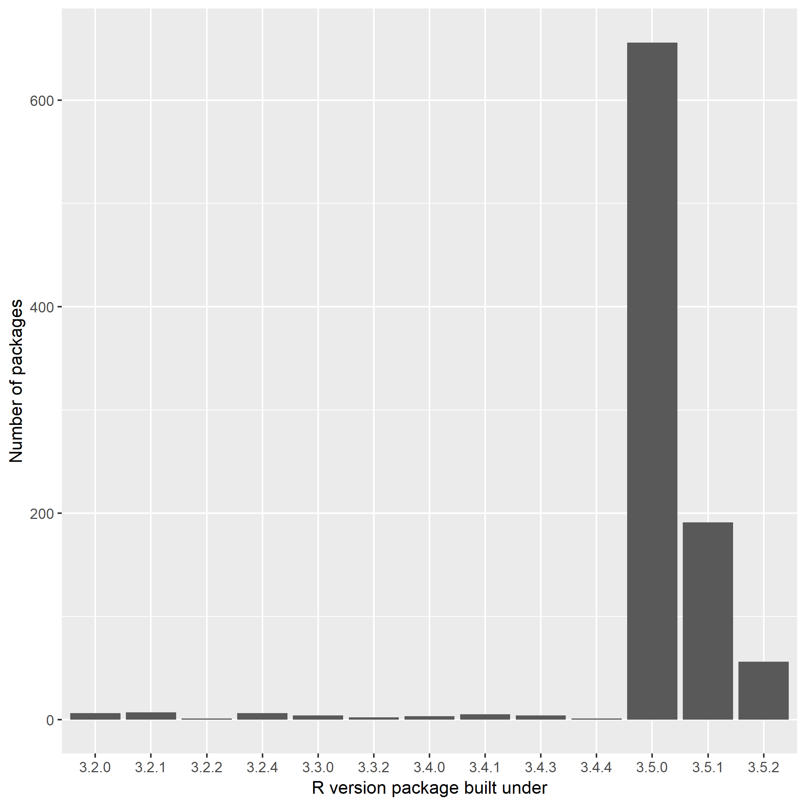

```{r setup, include = FALSE}
knitr::opts_chunk$set(collapse = TRUE)
library(tidyverse)
library(here)
```

# packages-report
A repo rstudio::conf workshop "What they Forgot to Teach You About R"

An edit from RStudio

Another change, this time from the browser

## Overview

The goal of packages-report is to FINISH THIS SENTENCE.

```{r, include = FALSE}
## load data/add-on-packages-freqtable.csv here in this chunk
freqtable  <- read_csv(here("data", "add-on-packages.csv"))

add_on_count <- freqtable %>% nrow()
  
```

I have `r add_on_count` add-on packages installed.

Here's how they break down in terms of which version of R they were built under, which is related to how recently they were updated on CRAN.

```{r, echo = FALSE}
## print the frequency table here
## make it prettier if you know how
```



<details>

<summary>Session info</summary>
```{r}
devtools::session_info()
```

</details>

# Adding weird words
- balderdash
- tamperproof
- not a weird word